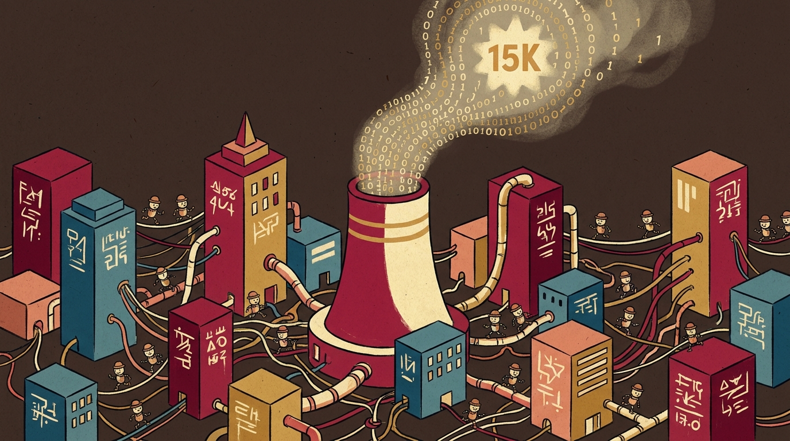
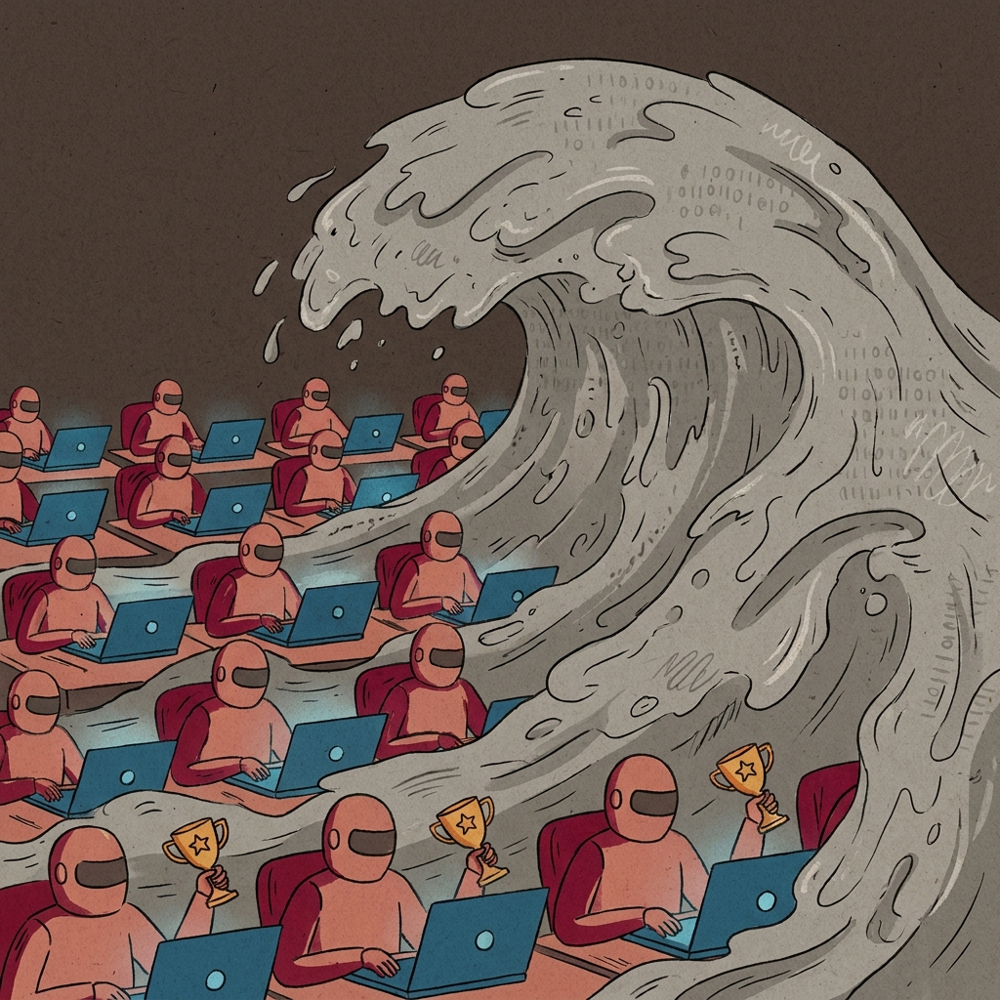
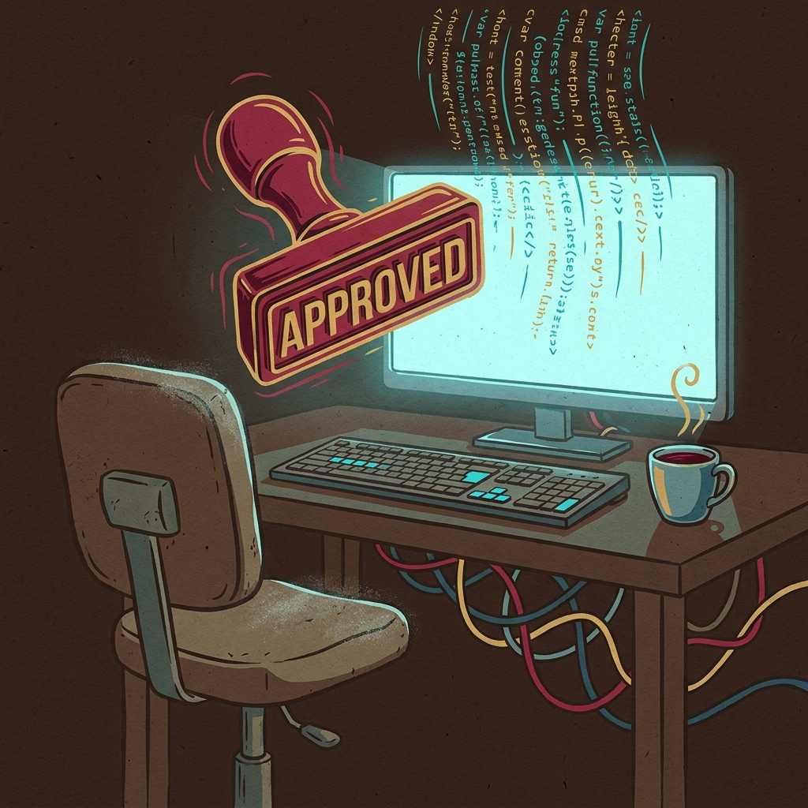

15k stars sur GitHub. C'est ce qu'a récolté [Gas Town](https://github.com/gastownhall/gastown), un orchestrateur multi-agents lâché dans la nature il y a quelques mois. Quinze mille personnes1 qui ont cliqué sur un bouton pour dire "Une vingtaine d'agents Claude Code qui tournent en parallèle, avec un patron qui pilote ces agents qui ouvrent des PR pendant que je dors ? Mais c'est génial !". Shut-up and take my money comme on dit.

Maggie Appleton a publié [un article](https://maggieappleton.com/gastown) qui m'a fait grincer des dents. Pas parce qu'elle se trompe, mais parce qu'elle a raison sur tout, et que ce qu'elle décrit donne un peu le vertige. Elle parle de Gas Town comme d'une preuve par l'exemple : voilà à quoi ressemble le développement logiciel quand on laisse des agents écrire la totalité du code, à pleine vitesse, sans frein. Le résultat est un système qui "brûle inefficacement des milliers de dollars d'API par mois"2, pour reprendre ses mots, et qui pourtant, et c'est là tout le malaise, laisse entrevoir l'avenir du développement informatique.

Il me semble intéressant de réfléchir autour de cette cacophonie. On a dépassé la notion de "l'IA va à tout vitesse" pour arriver à un coût qui se concrétise au niveau *global*. Cognitif, écologique, métier et identitaire.

Cet article reprend le fil de Maggie, mais creuse la question qu'elle effleure : quand on dit que coder ne coûte plus rien, qu'est-ce qu'on est vraiment en train d'oublier ?

## Gas Town est, comme son nom l'indique, une usine à gaz

"T'es développeur et t'a pas d'agents ? Non mais allo quoi !". Allez lire la doc du bouzin. On nage en plein délire schizophrénique. On nous parle de maire, de ville, de plateformes, de putois (je ne déconne pas), de convois on encore de molécules ? Et attendez, dans la même doc, on a des chiens, des témoins, des rafineries, ... Bref. Un jardon construit en à peine 4 mois, avec 297 contributeurs, 14 branches, 7 000 commits et 420 000 lignes de code. Ah et est-ce que je vous ai dit que le repo faisait 16 Go ? Ouais GIGA.

C'est du délire, au sens propre. Le but ? Faire tourner 20 à 30 agents en parallèle, sans se marcher dessus.

Ce qui me sidère, ce n'est pas que ce délire existe, l'humain fait ça depuis qu'il invente3. C'est plutot qu'il récolte 15k stars et que tout le monde applaudit avant d'avoir compris. Exactement comme OpenClaw4. Maggie reprend d'ailleurs un commentaire de Hacker News qui résume plutôt bien :

> Beads est une bonne idée, mal exécutée. Ce n'est pas un produit conçu au sens où on l'entend d'habitude, c'est plutôt un flux de pensée converti directement en code. Un programme qui n'est pas seulement vibe codé, il a aussi été vibe designé.
> 
> Gas Town, c'est clairement la même chose, multipliée par dix mille. Le nombre de concepts qui se chevauchent et qui sortent de nulle part dans ce design est étourdissant. Steve a une longueur d'avance sur son temps, mais on ne finira pas par utiliser ce truc. À la place, quelques-unes des intuitions de fond seront reprises dans d'autres agents, d'une façon plus simple mais pas moins efficace.
>
> <cite>Hacker News · janvier 2026</cite>

Et c'est exactement ça. Allez hop, c'est une bonne idée. Je star. Ça fait des articles sur deux trois sites et on enchaîne au prochain projet.

Gas Town ne me dérange pas en soi. C'est un pur délire par un gars (ce Steve) qui a probablement un peu de popularité à la base et qui a buzzé. Probablement un visionnaire, va savoir. Ce qui me dérange en revanche, c'est ce que ça révèle. Coder (et donc produire) toujours plus vite. Sans réflexion. Parce qu'avec 2-3 agents, on peut se poser la question mais avec 30 agents, qui a le temps d'assimiler ? Quel sera le prochain projet qui buzz après OpenClaw et Gas Town ? Et le suivant ?Quelle va être la friction contre cette inflation ? Et là, je sens qu'on va vite dériver vers la "bulle de l'IA" qui va éclater à la vitesse de l'éclair. L'histoire se répète.

## Prenez le temps d'e-penser5

Maggie pose le diagnostic. Si les agents écrivent le code à pleine vitesse, ce n'est plus l'écriture qui ralentit le projet, c'est la conception, le design et la réflexion. Tout ce qui se passe avant qu'on tape la première ligne. Elle reprend Steve Yegge6 :

> Le design et la pensée critique sont les nouveaux goulots d'étranglement.

Ok. Et du coup, dans la vraie vie, il se passe quoi ? Parce que si l'outil te pond en 30 secondes ce qui avant te prenait 2 jours, est-ce que tu vas utiliser ces 2 jours pour réfléchir à la prochaine feature ? Non. Tu vas enchainer, comme tu as l'habitude de faire. ~~Tu vas coder~~ (euh non) ~~Ton agent va coder~~ (ah non plus), tes 30 agents vont coder ta prochaine idée. Et puis la Merge Request7 sera aussi validée en 30 secondes, parce que franchement, qui a lu les 400k lignes de code de Gas Town, à votre avis ?

C'est là qu'est l'arnaque. On a remplacé un goulot mécanique (l'écriture du code) par un goulot mental (la conception). Et on veut nous faire croire que l'industrie semble bien vouloir la première promesse, sans payer la seconde. Pensez-vous donc que les développeurs qui codent 30x plus vite, pourront assimiler 30x plus de features ? Bonne chance si c'est ce cas.

Il faut prendre le temps de penser. Et pas de penser moins, au contraire, penser autrement. Se poser, faire chauffer vos neurones. Ne laissez pas l'IA penser à votre place car elle le fait mal. Alors c'est peut-être moins glamour qu'un troupeau de putois, mais à la fin, c'est surement ce qui distinguera le code d'un projet qui dure que celui d'un projet qu'on oubliera trop vite. Allez hop, une étoile sur github, et on passe à autre chose.

## Après le Vibe Coding, le Vibe Designing ?

Le vibe coding, c'est plié. Il va falloir s'y faire et pour ma part, j'ai presque pas touché une ligne de code depuis novembre 2025. Coder soi-même, c'est comme faire de la couture, les machines feront peut-être moins joli8 mais toujours plus vite, plus efficacement et donc moins cher. Coder soi-même en entreprise c'est donc bientôt fini pour de bon. Le temps que toutes les entreprises s'y mettent et que les modèles soient parfaitement au point.

Mais le vibe designing, c'est d'un autre niveau. Pourquoi réfléchir quand on a le génie d'Aladdin à portée de main ? La structure du projet ? Un agent. Le découpage des modules ? Un agent. Des noms pour des features ? Un agent (n'allez pas me dire que c'est un humain qui a pondu le putois, svp). Et l'humain là dedans ? Il valide. Il valide parce qu'il n'a plus le temps de réfléchir et de remettre en question des choix qu'il n'a plus à prendre. Et il valide parce que ça a l'air cohérent au premier coup d'oeil, qu'il n'a de toute façon pas (ou plus) les compétences pour comprendre, et puis parce que franchement, pas le temps de se poser ces questions à 23h.

Je ne me suis pas donné la peine d'aller voir moi-même, mais Maggie ne mâche pas ses mots sur Gas Town : designé à l'arrache, avec des bouts de ficelle sortis du chapeau, et un repo de 16 Go. Cherchez l'erreur.

Et ce qu'on a pas là de l'*AI slop*9 pris en flagrant délit ? Un énorme tsunami de merde d'une puissance si grande qu'internet ne représente même pas la taille de la côte de Fukushima. Ce bruit est plus fort que toutes les fusées de l'histoire lancées en même temps. Et ce bruit se transforme en contenu généré en masse et à une vitesse folle. Du contenu pas vraiment faux, pas vraiment juste. Pas vraiment drôle, pas vraiment mauvais. Pas vraiment beau, pas vraiment moche. Juste mouais. Juste IA. Juste slop. Sauf que ça occupe l'espace. On en mange partout et tout le temps. Du contenu visible, sur des articles SEO, des pubs. Ou moins visible, sur Reddit, Twitter. On fait de moins en moins attention et on accepte aussi. Et puis, acceptant, on consomme des images, de la musique et bientôt du cinéma10.

Du coup, à quel moment on commence et à quel moment on s'arrête ? A quel moment on se pose et on réfléchis ? Et à quel moment on décide d'utiliser l'IA comme un outil et pas comme si elle nous avait déjà remplacé ?

Stack Overflow n'est plus. Github le suivra bientôt. Et puis Reddit, Twitter, TikTok... La limite ne sera pas technique. Elle sera humaine. Et c'est à nous de prendre la décision et se dire : "Non, là je ne laisse pas mon agent IA décider. Je prends 30 minutes ou 1 heure, je dessine au tableau et je pose des idées avant de trouver la bonne. Est-ce que l'IA m'en a proposé aussi ? Certainement. Est-ce qu'elles sont les meilleures ? Possiblement. Mais je l'ai utilisé comme un outil. Juste un outil."

Entre nous, je n'ai pas vraiment envie qu'un agent décide à ma place ce qui mérite d'exister.

## Comment les développeurs vont survivre à tout ça ?

Pardon. Je me suis un peu emporté. Intéressons-nous à nouveau aux développeurs. C'est à dire à moi :) En partant du postulat qu'on accepte qu'un développeur code 30x plus vite. Est-ce qu'on va pour autant lui demander 30x plus de features ? Si c'est le cas, on va vite se demander où est passé son métier. Parce qu'un développeur, ce n'est pas uniquement coder. C'est comme si on disait qu'un auteur, son métier c'était d'écrire. Certes, mais écrire quoi ?

En 2024, un développeur écrivait son code. Celui de 2026 ne le fait plus mais il en reste pas moins garant. S'il décide de ne pas le lire, c'est son problème mais il devra en assumer les conséquences. Excellentes ou catastrophiques. Il faut donc qu'il soit capable de maitriser son architecture et son implémentation. Le développeur de 2026 n'est plus un pisseur de code mais il n'en est pas moins un ingénieur à qui on va, en fait, en demander beaucoup plus.

A titre personnel, je me sens déjà rouillé. Six mois sans presque toucher une ligne de code, et j'ai perdu tous mes réflexes de codeur. La mémoire musculaire, non-entrenue disparait, très vite. Et elle disparaitra pour tous. Or, il va tout de même falloir conserver son intuition. Sentir quand un design est mauvais avant de l'écrire. Sentir quand votre agent fait n'importe quoi, quand il est à côté de la plaque. Et c'est là, pour moi, que le métier survivra.

Et les juniors, alors ? Ceux qui n'ont jamais pu travailler sur ces problèmes et développer leur matière grise ? A force de demander à l'IA de faire ceci, de ne même plus relire les merge requests, et de ne jamais avoir codé après avoir quitté l'école ? On va commencer à fabriquer la première génération de devs qui n'auront jamais cherché un bug ou debuggué une application. Et peut-être encore plus important, n'auront jamais ressenti la fierté un peu débile d'un code qui passe la build et les tests du premier coup. Et à ces juniors, il faudra leur dire qu'avec l'IA, ce seront de meilleurs développeurs, plus productifs ? Bonne chance à eux.

Il faut aussi parler de l'éléphant dans la pièce. La charge mentale qui va décupler. Avant, il fallait comprendre, découper et écrire le code. Ensuite tester, passer la merge request et valider celle de son collègue. Maintenant, il faut comprendre, découper et donner le code à son agent. Ensuite, on passe la merge request et on valide les 240 merge requests des 30 putois qui ont chacun corrigé le même bug ? Pardon, je me calme, mais je crois pas qu'on ai un jour expliqué aux developpeurs qu'ils allaient devenir des chefs d'orchestre.

Et il reste enfin le dernier rempart. Le plaisir. Ce plaisir qu'on aura, pendant encore quelques temps, le luxe d'en profiter uniquement pendant nos weekends. Le choix du nom d'une variable. La classe qu'on a fièrement construite en single-responsibility. Une API REST qu'on a bien comprise. L'optimisation d'un algo pour faire exactement ce qu'on a imaginé au départ. Eh bien au nom de la productivité, ce plaisir, l'IA nous l'a volé pour toujours.

Alors quand on parle de coût, il est là. Le coût de la compétence qui s'éfrite et du plaisir qui s'évapore. Et malheureusement, on est incapable de le mesurer.

## Faut-il encore relire le code ?

Le fondateur de Gas Town ne relit jamais ~~son code~~ le code de son agent. Il le dit explicitement sur son blog. Et beaucoup de devs lisent ça et se disent certainement qu'ils peuvent arrêter aussi. Si lui le fait, pourquoi pas moi ? Ça arrange tout le monde en plus, parce que franchement, qui a envie de lire 400k lignes de go pendant son weekend ?11

Maggie aborde le sujet avec plus de nuance12. Elle dit en gros : la question n'est pas de relire ou pas, parce que la réponse est "ça dépends". À titre perso, il y a des cas où relire est quand même un peu débilitant et absurde. Et nier cela serait juste mentir.

Mais à l'échelle collective ? Si plus personne ne relit, il se passe quoi ? Si l'IA produit tellement de code qu'on a même plus les moyens de le relire ? Des bugs ? Certes. Elle les corrigera. Des fuites de clés, des CVE ? Plus grave déjà. Et les juniors du coup ? Il ne progressent plus ? De toute façon, il liront du code écrit par des machines. Pas très encourageant. De toute façon, il n'y aura bientôt plus aucun standard donc plus rien à transmettre.

Mais si vraiment on ne relit plus, alors il n'y a plus d'audit. Sans audit, fini les dépendances. Sinon on va se retrouver à miner du bitcoin sans s'en rendre compte, à devoir payer une rançon pour retrouver ses données ou à voir son collègue se faire vider son compte bancaire pendant la pause café. Flippant.

Bref. Steve Yegge13 peut bien faire ce qu'il veut. Mais quand son geste deviendra celui qui légitime un abandon collectif de la relecture, alors on aura un vrai problème. L'effondrement progressif de la génération internet pendant que leurs développeurs valideront les merge request en 30 secondes, au calme.

## Et donc, qu'est-ce que ça coûte ?

On en est là. Gas Town14, le tout nouvel orchestrateur multi-agents, qui pèse 1,5 fois l'intégrale d'Harry Potter, codé en 4 mois par des bots. Il va brûler vos tokens (et réchauffer la terre) plus vite que n'importe quel outil pour sloper plus rapidement que Flash et sortir des milliers de nouveaux produits par jour. Ou peut-être flooder dans les commentaires de Reddit, Instagram ou de Youtube, on verra.

Et tout ça ne nous coutera pas que la facture d'Anthropic. La pensée critique qui ne s'aligne pas sur le tempo de ces milliers d'agents. Le design copié-collé-recopié-recollé. Le métier de développeur, le plus rapide de l'histoire du monde du travail à disparaitre. L'apprentissage et la transmission devenus inutiles. Et la faille de sécu qu'on découvrira le lundi matin.

Je ne suis pas contre l'IA. Je l'utilise tous les jours, c'est même elle qui m'a aidé à monter ce site. Je fais partie du système et je fais également partie de ceux qui relisent de moins en moins leur code. Ce qui me dérange, c'est qu'on ait collectivement décidé qu'elle pouvait tout faire à notre place, sans qu'on prenne une seconde pour se demander si c'était une bonne idée. Le vrai sujet, ce n'est pas l'outil. C'est ce qu'on en fait. Et qui en paye le prix.

La prochaine fois qu'un projet comme Gas Town apparait sur ton fil Twitter ou Instagram avec ses 15 000 stars, prends 30 secondes pour réfléchir. Demande-toi : est-ce que je star aussi parce que c'est **vraiment** utile, ou parce que c'est un gros projet qui buzz ? Est-ce que je vais vraiment profiter du code source de ce projet ou le forker ? Est-ce que je veux vraiment vivre dans le monde que ce projet prépare en silence ?

Coder ne coûte vraiment plus rien ?

Si. Ça coûte tout le reste.
