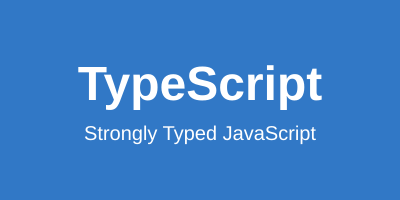

# Premiers pas avec TypeScript : Guide complet pour débutants

TypeScript est devenu un outil incontournable dans le développement web moderne. Si vous êtes développeur JavaScript et que vous hésitez encore à franchir le pas, cet article est fait pour vous.

## Pourquoi TypeScript ?



TypeScript apporte plusieurs avantages majeurs au développement JavaScript :

- **Typage statique** : Détectez les erreurs avant même d'exécuter votre code
- **Meilleure IDE support** : Autocomplétion intelligente et refactoring sécurisé
- **Code plus maintenable** : Documentation intégrée via les types
- **JavaScript moderne** : Support des dernières fonctionnalités ECMAScript

## Installation et configuration

Commençons par installer TypeScript dans votre projet :

```bash
npm install -D typescript @types/node
npx tsc --init
```

Cela créera un fichier `tsconfig.json` avec une configuration de base. Voici une configuration recommandée pour débuter :

```json
{
  "compilerOptions": {
    "target": "ES2020",
    "module": "commonjs",
    "lib": ["ES2020"],
    "outDir": "./dist",
    "rootDir": "./src",
    "strict": true,
    "esModuleInterop": true,
    "skipLibCheck": true,
    "forceConsistentCasingInFileNames": true
  }
}
```

## Types de base

TypeScript offre plusieurs types primitifs :

```typescript
// Types primitifs
let isDone: boolean = false;
let decimal: number = 6;
let color: string = "blue";

// Arrays
let list: number[] = [1, 2, 3];
let fruits: Array<string> = ["pomme", "banane", "orange"];

// Tuples
let x: [string, number] = ["hello", 10];

// Enums
enum Color {
  Red,
  Green,
  Blue
}
let c: Color = Color.Green;
```

## Interfaces et types

Les interfaces sont l'une des fonctionnalités les plus puissantes de TypeScript :

```typescript
interface User {
  id: number;
  name: string;
  email: string;
  age?: number; // propriété optionnelle
}

function createUser(user: User): void {
  console.log(`Création de l'utilisateur ${user.name}`);
}

// Types alias
type Status = "pending" | "approved" | "rejected";

interface Order {
  id: string;
  status: Status;
  items: string[];
}
```

## Fonctions typées

TypeScript permet de typer les paramètres et les valeurs de retour :

```typescript
// Fonction avec types
function add(x: number, y: number): number {
  return x + y;
}

// Fonction fléchée
const multiply = (x: number, y: number): number => x * y;

// Paramètres optionnels et par défaut
function buildName(firstName: string, lastName?: string): string {
  return lastName ? `${firstName} ${lastName}` : firstName;
}

// Paramètres rest
function sum(...numbers: number[]): number {
  return numbers.reduce((acc, curr) => acc + curr, 0);
}
```

## Classes et POO

TypeScript améliore considérablement l'expérience de la programmation orientée objet :

```typescript
class Animal {
  private name: string;
  protected age: number;
  
  constructor(name: string, age: number) {
    this.name = name;
    this.age = age;
  }
  
  public speak(): void {
    console.log(`${this.name} fait du bruit`);
  }
}

class Dog extends Animal {
  private breed: string;
  
  constructor(name: string, age: number, breed: string) {
    super(name, age);
    this.breed = breed;
  }
  
  public bark(): void {
    console.log("Woof! Woof!");
  }
}
```

## Generics

Les generics permettent de créer des composants réutilisables :

```typescript
// Fonction générique
function identity<T>(arg: T): T {
  return arg;
}

// Interface générique
interface Box<T> {
  value: T;
}

const numberBox: Box<number> = { value: 123 };
const stringBox: Box<string> = { value: "hello" };

// Classe générique
class Stack<T> {
  private items: T[] = [];
  
  push(item: T): void {
    this.items.push(item);
  }
  
  pop(): T | undefined {
    return this.items.pop();
  }
}
```

## Types utilitaires

TypeScript fournit plusieurs types utilitaires prédéfinis :

```typescript
interface Todo {
  title: string;
  description: string;
  completed: boolean;
}

// Partial : rend toutes les propriétés optionnelles
type PartialTodo = Partial<Todo>;

// Required : rend toutes les propriétés obligatoires
type RequiredTodo = Required<Todo>;

// Readonly : rend toutes les propriétés en lecture seule
type ReadonlyTodo = Readonly<Todo>;

// Pick : sélectionne certaines propriétés
type TodoPreview = Pick<Todo, "title" | "completed">;

// Omit : exclut certaines propriétés
type TodoInfo = Omit<Todo, "completed">;
```

## Conseils et bonnes pratiques

1. **Activez le mode strict** : Toujours utiliser `"strict": true` dans votre tsconfig.json
2. **Évitez `any`** : Utilisez `unknown` si vous ne connaissez pas le type
3. **Utilisez les types unions** : Préférez `string | number` à `any`
4. **Documentez avec JSDoc** : Les commentaires JSDoc fonctionnent très bien avec TypeScript
5. **Utilisez des ESLint** : Configurez ESLint avec les règles TypeScript

## Ressources pour aller plus loin

- [Documentation officielle TypeScript](https://www.typescriptlang.org/)
- [TypeScript Deep Dive](https://basarat.gitbook.io/typescript/)
- [TypeScript Playground](https://www.typescriptlang.org/play)

## Conclusion

TypeScript n'est pas juste un ajout de types à JavaScript, c'est un véritable superset qui améliore votre productivité et la qualité de votre code. Commencez petit, adoptez progressivement les fonctionnalités avancées, et vous ne pourrez plus vous en passer !

N'hésitez pas à partager vos expériences avec TypeScript dans les commentaires ci-dessous.